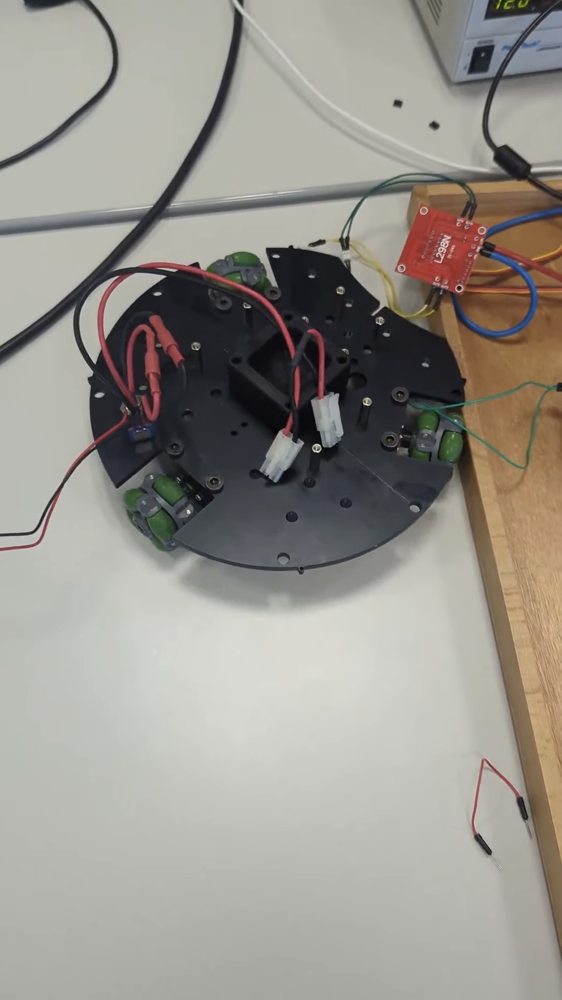

# 🚀 HKS Rover - Web-Controlled Robot

A real-time web-based rover control system built for our school Info-Day project. This system enables remote control of an omnidirectional robot through a modern web interface with live camera streaming.

> **🤖 Arduino Firmware**: [HKS Rover Arduino](https://github.com/Script-hpp/hks-rover-arduino) - The firmware that runs on the rover's Arduino UNO R4 WiFi and ESP32-CAM.

## 📋 Table of Contents

- [Features](#-features)
- [Architecture](#-architecture)
- [Prerequisites](#-prerequisites)
- [Installation](#-installation)
- [Usage](#-usage)
- [Troubleshooting](#-troubleshooting)
- [Project Structure](#-project-structure)
- [License](#-license)

## ✨ Features

### Intuitive Controls
- **Web-based control interface** with keyboard and gamepad support for precise movement control
- Controller support (XBOX/PS/Steam Deck/Nintendo)
- Sensitivity adjustment

### Live Video Stream
- **Real-time video streaming** with ESP32-CAM integration
- HD streaming capabilities
- Remote camera feed display

### Remote Connectivity
- **Secure internet connection** allowing global access
- WebSocket connection
- MQTT over Mosquitto broker
- SSL encryption
- Global accessibility
- Auto-reconnection

### OmniMotor Control
- **Motor driver for omnidirectional movement** and precise control
- Forward, backward, left, right movement
- Rotation controls
- Variable speed control

## 🏗️ Architecture

This project uses a **client-server architecture** with MQTT as the communication protocol:

```
┌─────────────┐         ┌──────────────┐         ┌─────────────┐
│   Browser   │ ◄─WSS──►│ MQTT Broker  │ ◄─TLS──►│   Arduino   │
│  (Web UI)   │  :9001  │  (Mosquitto) │  :443   │   (Rover)   │
└─────────────┘         └──────────────┘         └─────────────┘
                               │
                               │ HTTP/WS
                               ▼
                        ┌──────────────┐
                        │ Node.js      │
                        │ Server       │
                        │ (Camera API) │
                        └──────────────┘
```

### Why MQTT?

The Arduino UNO R4 WiFi cannot directly communicate with browsers using WebSockets. To solve this, we use an **MQTT broker** as a message relay:

- **Browser → Broker**: Uses MQTT over WebSockets (WSS) on port 9001
- **Arduino → Broker**: Uses MQTT over TLS on port 443
- **Broker**: Routes messages between both clients

This architecture allows bidirectional communication without requiring the Arduino to implement WebSocket protocols.

## 📦 Prerequisites

### Server Requirements
- **Node.js** (v14 or higher)
- **MQTT Broker** (Mosquitto recommended)
- **NGINX** (for reverse proxy and SSL termination)

### Hardware Requirements
- **ESP32-CAM** module for live video streaming
  - Note: The ESP32-CAM has limited memory, so images must be sent in chunks to the `/api/camera/upload` endpoint

### Client Requirements
- Modern web browser (Chrome, Firefox, Edge, Safari)
- Optional: Compatible gamepad (XBOX/PS/Steam Deck/Nintendo)

## 🚀 Installation

### 1. Clone the Repository

```bash
git clone https://github.com/Script-hpp/hks-rover.git
cd hks-rover
```

### 2. Install Dependencies

```bash
npm install
```

### 3. Configure MQTT Broker

You'll need an MQTT broker with the following configuration:

- **Port 443**: MQTT over TLS (for Arduino)
- **Port 9001**: MQTT over WebSockets (for browser)

> **Note**: Setting up the MQTT broker with NGINX reverse proxy requires advanced configuration. If you're hosting this yourself, you'll need to configure Mosquitto and NGINX to handle both TLS and WebSocket connections. Contact me for detailed broker setup instructions.

### 4. Update Configuration

Edit `public/js/rover.js` and update the MQTT broker settings:

```javascript
const MQTT_SERVER = 'your-broker-domain.com';  // Your MQTT broker address
const MQTT_PORT = '9001';                       // WebSocket port
const MQTT_TOPIC = 'rover/control';             // MQTT topic
```

### 5. Start the Server

```bash
node server.js
```

The web interface will be available at `http://localhost:3000`

## 🎮 Usage

### Web Interface

1. Open your browser and navigate to `http://localhost:3000`
2. Click **"Connect to MQTT Broker"** to establish connection
3. Use the on-screen controls or keyboard/gamepad to control the rover


### Gamepad Controls

- **Left Stick**: Movement (forward/backward/left/right)
- **Right Stick**: Rotation
- **L1**: Kicker
- **L2/R2**: Gas/Boost
- **A/Y**: Forward
- **B/X**: Backward

### Camera Feed

The camera feed automatically connects when you open the page. You can:
- Enter a custom camera stream URL
- Click the refresh button to reload the feed
- Monitor FPS in real-time

## 🔧 Troubleshooting

### MQTT Only Worked Over Mobile Hotspot
**Problem**: MQTT communication worked fine when connected to a mobile hotspot but failed over standard Wi-Fi networks. Public and many home routers often block MQTT's default port (1883) or restrict unknown protocols.

**Solution**: We configured a reverse proxy using NGINX, which listens on port 443 (TLS/HTTPS) and forwards connections to the internal MQTT broker. This allowed the Arduino to connect securely using MQTT over TLS on port 443, bypassing most firewall restrictions.

### Web Frontend Could Not Connect to MQTT
**Problem**: The browser-based control interface couldn't communicate with the MQTT broker because browsers require MQTT over WebSockets (WSS), not raw MQTT.

**Solution**: We enabled MQTT over WebSockets on port 9001 on the broker and routed it through NGINX. The frontend now uses WSS on port 9001 to communicate, while the Arduino continues to use port 443 over TLS.

### Camera Shows "Connection Error"
**Problem**: The camera feed displays "Connection Error" even though the server is running.

**Solution**: 
- Ensure the ESP32-CAM is uploading frames to `/api/camera/upload`
- Check that the image format is valid JPEG
- Verify the camera URL is correct in the web interface
- **Important**: The ESP32-CAM has limited memory (~4KB SRAM). Images must be captured and sent in small chunks to avoid memory overflow. Our implementation broke after extended use due to hardware limitations.

### Controls Not Responding
**Problem**: Clicking control buttons doesn't move the rover.

**Solution**:
- Verify MQTT connection status (should show "MQTT Connected")
- Check that the Arduino is connected to the same MQTT broker
- Ensure the MQTT topic matches on both sides

## 📁 Project Structure

```
hks-rover/
├── public/
│   ├── css/
│   │   └── style.css          # UI styling
│   ├── js/
│   │   ├── rover.js           # Main control logic
│   │   └── rover-preview.js   # 3D rover preview
│   └── index.html             # Web interface
├── server.js                  # Node.js server & camera API
├── camera_sim.js              # Camera simulation script (for testing)
├── package.json               # Dependencies
└── README.md                  # This file
```

## 🎓 About This Project

This project was created for our school Info-Day presentation. It demonstrates:
- Real-time communication using MQTT
- Web-based robotics control
- Live video streaming integration
- Modern web development practices

The Arduino code and hardware setup will be added in a separate repository.

## 📸 Gallery



## 🙏 Special Thanks

- **[OnlyCook](https://github.com/OnlyCook)** - For the amazing 3D rover models used in the preview
- **[Nam Feist](https://github.com/NamCraft)** - For helping with electronics and code development
- **Herr Wilke** - Our teacher for providing the Arduino hardware and invaluable guidance throughout the project


## 📄 License

This project is open source and available for educational purposes.

---

**Web-Interface built with ❤️ by Onuralp Akca, Nam Feist**

